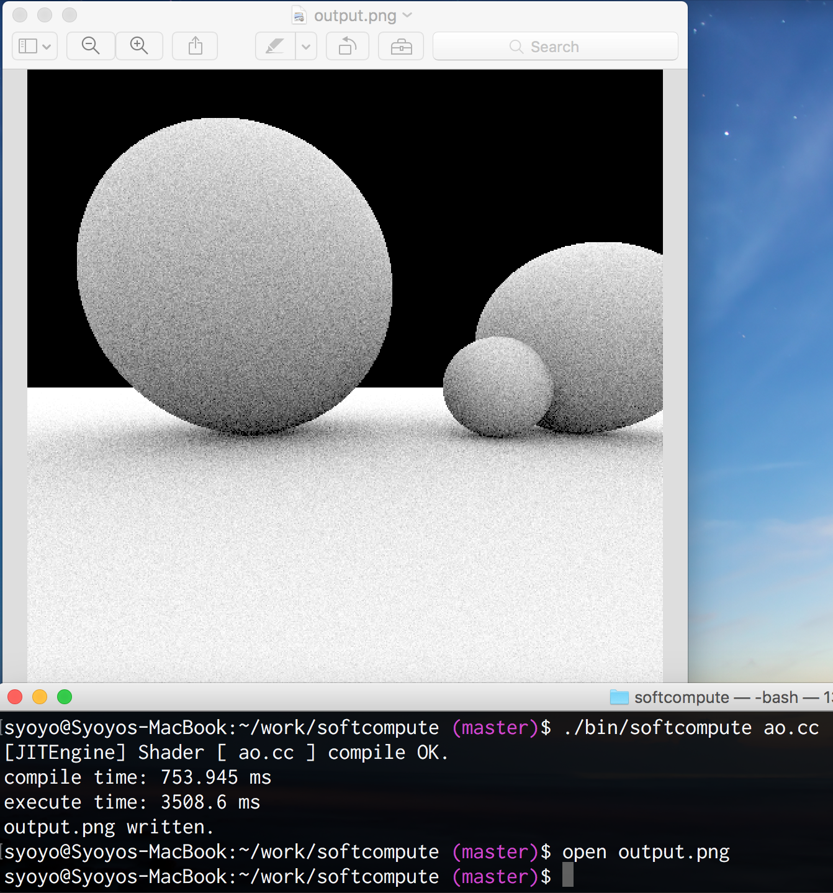

# SoftCompute, CPU execution of SPIR-V compute shader.

## Features and Purpose

* Debug compute shader more easily.
* Run compute shader where no compute shader capable OpenGL device is available.
* dll based shader execution(Mac, Win, Linux)
* clang/LLVM JIT shader execution(Mac and Linux)

## Limitations

* Currently `SoftCompute` only could be able to run very simple compute shader.

## Requirements

* Premake5 https://premake.github.io/download.html
* Recent C++11 ready clang or gcc compiler
* glslang https://github.com/KhronosGroup/glslang
* SPIR-Cross https://github.com/KhronosGroup/SPIRV-Cross
* glm 0.9.7.4 or later http://glm.g-truc.net/
* MinGW compiler(on Windows)

### Optional

* clang/LLVM 3.8+ http://llvm.org/releases/download.html
  * GNU STL or libc++ depending on your clang/LLVM build configuration
  * At least 3.8 prebuilt package for CentOS6 and El Capitan confirmed working

## Setup

Put `glm` directory to this directory(or create a symlink).

    $ ls
    glm
    spirv_cross
    bin
    src
    ... 

## Build on Linux or MacOSX

    $ premake5 --spirv-cross=/path/to/SPIRV-Cross gmake
    $ make

### JIT version

You can build JIT version of `SoftCompute` using `--enable-jit` flag.

    $ premake5 --enable-jit --llvm-config=/path/to/llvm-config --spirv-cross=/path/to/SPIRV-Cross gmake

Then,

    $ export CXX=clang++
    $ make

## Setup and how to run

Create cpp shader from GLSL using `glslangValidator` and `spirv-cross`

    $ glslangValidator -V shaders/ao.comp
    $ spirv-cross --output ao.cc --cpp comp.spv

Then,

    $ ./bin/softcompute ao.cc

### Run GLSL or SPV

`SoftCompute` can also take GLSL or SPIR-V file directly and compile it using `glslangValidator` and/or `spirv_cross` by calling these command internally.

To use these feature, Add path to `glslangValidator` or set environment variable `GLSLANG_VALIDATOR` to point to `glslangValidator`.
Add path to `spirv-cross` or set environment variable `SPIRV_CROSS` to point to `spirv-cross`.

Then,

    $ ./bin/softcompute ao.comp

or

    $ ./bin/softcompute ao.spv

### Note on JIT version.

You may need manually edit C/C++ header path in `src/jit-engine.cc`

### How it works

* Compile GLSL compute shader into SPIR-V binary using `glslangValidator`(through pipe execution)
* Convert SPIR-V to C++ code using `spirv-cross`(through pipe execution, since `spirv-cross` uses C++ RTTI and LLVM precompiled binary is not built with RTTI)
* (DLL) Compile C++ code into dll and open it using dlopen or LoadLibrary.
* (JIT) Read C++ code and JIT execute using clang/LLVM.

## License

* SoftCompute is licensed under Apache 2.0 License.

### Third party license

* spirv_cross header files are licensed under Apache 2.0 License.
* src/OptionParser is licensed under MIT License.
* src/stb_image_write.h is public domain license.

## Limitation

Only support simple compute shader at this time.

## TODO

* [ ] Read header path from file or else
* [ ] Support various shader type.
* [ ] Flexible shader value binding.
* [ ] Debugger support.
* [ ] GUI?
* [ ] Windows support.
* [ ] Interactive edit & run.
  * [ ] Watch file changes.
* [ ] Multi-threaded execution.
* [ ] gitsubmodule `glm`

